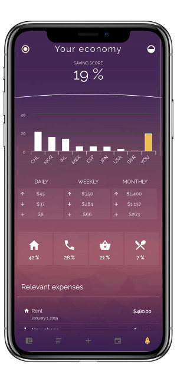

# [Bankist](https://bankist.xyz)

### What is your wallet doing?

Bankist helps you keep track of your expenses, analyze your movements and forecast your savings.

### Why use bankist?

Bankist is a simple tool to analyze the course of your personal finance and learn to save. One of the main problems in the management of the personal economy is the lack of control and vision on how expenses are distributed, which are essential and which are superfluous ...

The application allows you to visualize your wallet as a graph, as a list and in calendar mode, in past moments and in future moments... Learn to anticipate your expenses!

Add your movements indicating a concept, a quantity and a date. In addition, you can categorize your movements and mark the movement as a movement that will be repeated periodically indicating its periodicity and start and end date.

### What about my personal data?

Bankist is a local application that does not send users data to any server, we do not want to know your financial info, we want you to know it.

### Savings plans.

Create savings plans and track your wallet to see how to achieve the proposed plan.

### Export and import.

Exports and imports your wallet movements.

## Table of Contents

- [Author](#author)
- [Getting Started](#getting-started)
- [App Preview](#app-preview)
- [Deploying](#deploying)
  - [Progressive Web App](#progressive-web-app)
  - [Android](#android)
  - [iOS](#ios)
  - [MacOS](#macOS)

## Author

Bankist is developed by Alfonso Fernández - [fernandz.es](https://fernandz.es/)

## Getting Started

* [Download the installer](https://nodejs.org/) for Node.js 6 or greater.
* Install the ionic CLI globally: `npm install -g ionic`
* Clone this repository: `git clone https://github.com/bankist/bankist.git`.
* Run `npm install` from the project root.
* Run `ionic serve` in a terminal from the project root.
* :tada:

_Note: See [How to Prevent Permissions Errors](https://docs.npmjs.com/getting-started/fixing-npm-permissions) if you are running into issues when trying to install packages globally._

## App Preview

## Deploying

### Progressive Web App

1. Un-comment [these lines](https://github.com/ionic-team/ionic2-app-base/blob/master/src/index.html#L21)
2. Run `npm run ionic:build --prod`
3. Push the `www` folder to your hosting service

### Android

1. Run `ionic cordova run android --prod`

### iOS

1. Run `ionic cordova run ios --prod`

### MacOS

1. Bankist desktop is also available in MacOS thanks to electronJS, go to the [Bankist desktop](https://github.com/bankist/bankist-desktop) repository.
